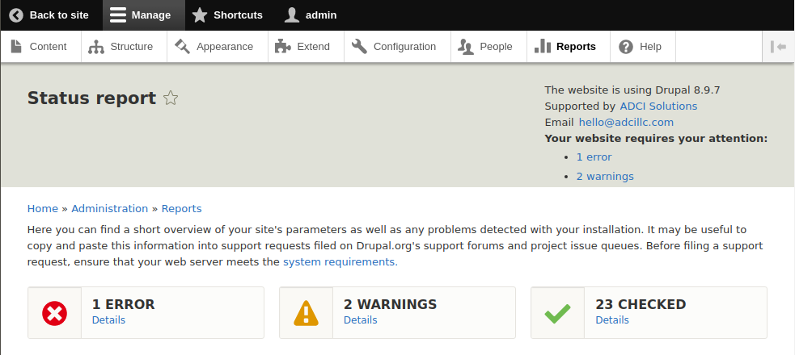

INTRODUCTION
------------

The "ADCI Solutions contact information" module adds ADCI Solutions contact information block to the "Header" region
of used on a website administration theme for users with "Administer site configuration" permission.

REQUIREMENTS
------------

This module requires no modules outside of Drupal core.

INSTALLATION
------------
 * Download the module's code from the repo and extract to a website's `modules/custom` directory.

 * Rename the module's directory to `adci_contact_info`.

 * Install as you would normally install a contributed Drupal module. Visit
   https://www.drupal.org/node/895232/ for further information.

CONFIGURATION
-------------

On installation module tries to add the block to the "Header" region, assuming that a website administration theme is
set to one of Drupal core's Seven or Claro themes or contributed
[Adminimal](https://www.drupal.org/project/adminimal_theme) theme. For another administration theme manual configuration
may be required.

 * Verify that used administration theme is Seven, Claro or Adminimal and that block is placed to proper region and in
   proper order and looks well.

 * If used administration theme is not Seven, Claro or Adminimal, navigate to the `/admin/structure/block` page, select
   used administration theme in the secondary navigation and place the "ADCI Solutions contacts" block to a region that
   fits best.

DISTRIBUTIONS
-------------

For use with a contributed Drupal distribution, after installation and configuration of the module additionally do the
following:

* navigate to the `/admin/structure/block` page;
* select used administration theme in the secondary navigation;
* navigate to the block configuration form using "Configure" button;
* set the Title field value within the "Site Link" fieldset to "The profile is created by" and save the block.

In result, the block's content should say something like:

> The website is using Drupal 8.9.10  
> The profile is created by [ADCI Solutions]()  
> Email [hello@adcillc.com]()  
> **Your website requires your attention:**
>
> - [1 error]()
> - [2 warnings]()
